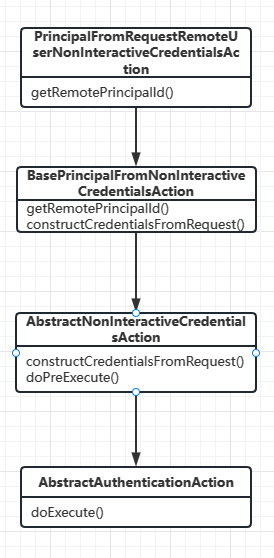
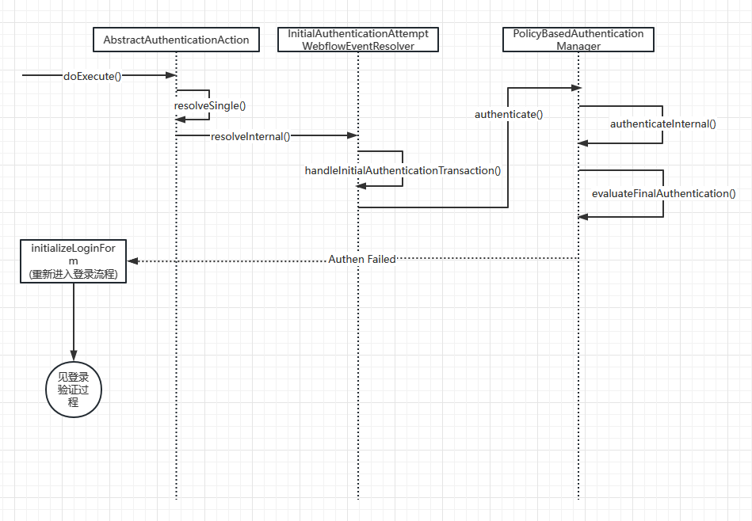

# CAS5.3-Token登录的验证过程 | 字痕随行

之前也写过登录验证的过程，这章专门来分析使用Token时登录的验证过程。

其实用两张图就大概能够说明整个过程了，下面是**第一张图**，验证过程触发点：


整个过程的配置类是：
```java
TrustedAuthenticationWebflowConfigurer
```
关键的配置代码：
```java
@Override
protected void doInitialize() {
    final Flow flow = getLoginFlow();
    if (flow != null) {
        final EvaluateAction action = createEvaluateAction("remoteUserAuthenticationAction");
        //省略代码若干
        setStartState(flow, actionState);
    }
}
```
其中remoteUserAuthenticationAction的配置代码是：
```java
@ConditionalOnMissingBean(name = "remoteUserAuthenticationAction")
@Bean
public Action remoteUserAuthenticationAction() {
    final ChainingPrincipalFromRequestNonInteractiveCredentialsAction chain =
            new ChainingPrincipalFromRequestNonInteractiveCredentialsAction(initialAuthenticationAttemptWebflowEventResolver,
                    serviceTicketRequestWebflowEventResolver,
                    adaptiveAuthenticationPolicy,
                    trustedPrincipalFactory(),
                    remoteRequestPrincipalAttributesExtractor());
    chain.addAction(principalFromRemoteUserAction());
    chain.addAction(principalFromRemoteUserPrincipalAction());
    chain.addAction(principalFromRemoteHeaderPrincipalAction());
    return chain;
}
```
然后看**第二张图**就可以了：


其中authenticateInternal()是最关键方法，会循环调用注册过的验证方法：
```java
protected AuthenticationBuilder authenticateInternal(final AuthenticationTransaction transaction) throws AuthenticationException {
   //此处省略代码若干

    try {
            //此处省略代码若干
            final Iterator<AuthenticationHandler> itHandlers = handlerSet.iterator();
            boolean proceedWithNextHandler = true;
            //开始循环验证，这里可能包含用户密码和Token两个验证
            while (proceedWithNextHandler && itHandlers.hasNext()) {
                final AuthenticationHandler handler = itHandlers.next();
                //这里就是handler里面要设置凭证类型的意义所在
                if (handler.supports(credential)) {
                    //省略验证过程代码
                } else {
                    LOGGER.debug("Authentication handler [{}] does not support the credential type [{}]. Trying next...", handler.getName(), credential);
                }
            }
        }
        //去指定的默认策略核验，一般会在配置文件里面设置
        evaluateFinalAuthentication(builder, transaction);
        return builder;
    } finally {
        AuthenticationCredentialsThreadLocalBinder.clearInProgressAuthentication();
    }
}
```
这里只描述了验证失败的情况，在成功的情况下只是不会走后面的登录流程而已。


觉的不错？可以关注我的公众号↑↑↑