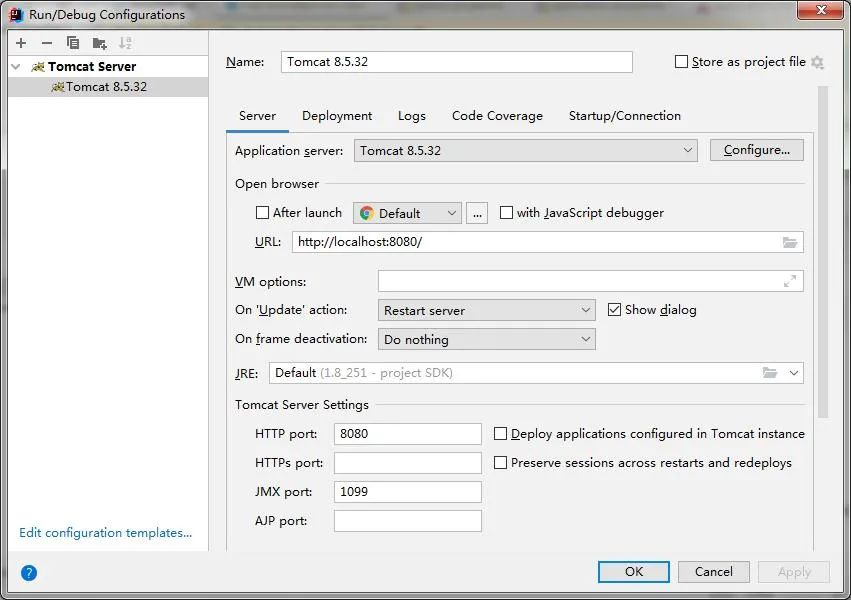
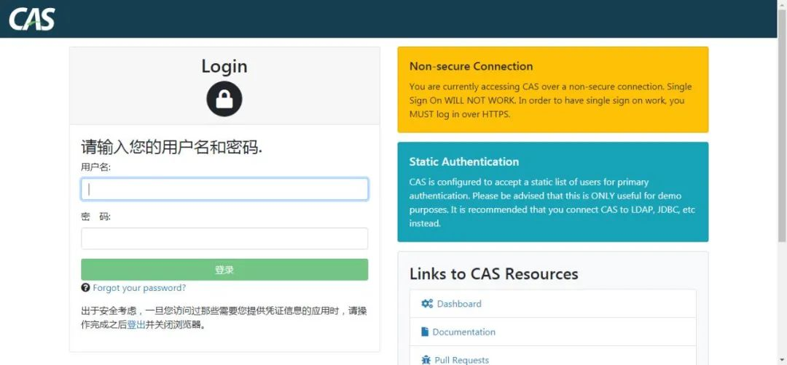
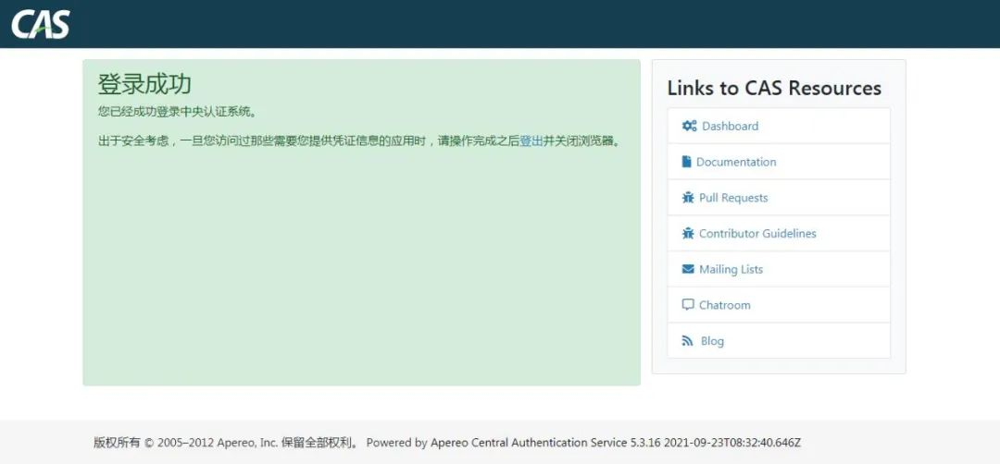
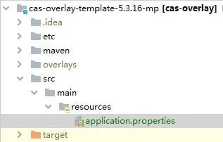

# CAS5.3-启动运行 | 字痕随行

令我非常讨厌的冬天终于来了，不过好在这两天来了暖气，不至于冻得哆哆嗦嗦。

目前CAS定制化，在预计中的章节包括：

1. 连接自定义数据库完成身份验证
2. 增加图片验证码
3. 使用Token认证

可能还包括一些杂七杂八的东西，另外还得介绍一下CAS和SpringBoot的集成。

本章继续介绍CAS5.3的定制化，上一篇和本篇都是非常基础的东西，如果不写就显得突兀，如果写又非常鸡肋。

上面都是凑字数的东西，下面才是简单不能再简单的正文。

按上一篇初始化项目之后，在IDEA中完成Tomcat配置：



然后直接运行，在浏览器中访问：

```Plain Text
http://localhost:8080/

```
出现登录界面：



输入用户名：casuser，密码：Mellon，登录成功：



用户名和密码在配置文件application.properties中：

```Plain Text
##
# CAS Authentication Credentials
#
cas.authn.accept.users=casuser::Mellon

```
接下来可以简单尝试一下overlay开发方式。新建src/main/resources，将上文中的application.properties拷贝至此文件夹，如下图所示：



更改上文中的配置值为：

```Plain Text
##
# CAS Authentication Credentials
#
cas.authn.accept.users=casuser::123456

```
重新启动tomcat（使用Maven Clean和Package），使用新的账户和密码登录，即可登录成功。

以上，简单的介绍了一下启动和运行的过程，接下来就会介绍定制过程了。

如果有问题，欢迎指正讨论。


觉的不错？可以关注我的公众号↑↑↑