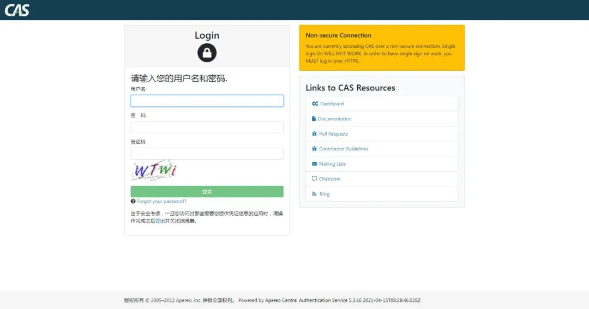
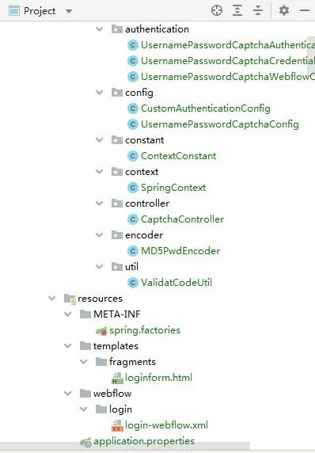

# CAS5.3-自定义Handler实现验证码 | 字痕随行

上一篇所述的方式只是简单的解决了日常登录的需求，但是在为了安全的情况下，一般在登录的时候都会有图片验证码、二次身份认证等要求。

本章介绍一下，如何在登录时增加图片验证码。

CAS提供了一系列验证处理器，并且可以通过配置文件配置验证策略。

但是在看了一遍官方文档关于配置文件的说明并且进行了数次尝试之后，我只能选择了如下配置：

```Plain Text
# cas.authn.policy.req.tryAll=false
# cas.authn.policy.req.handlerName=handlerName
# cas.authn.policy.req.enabled=true

```
官方文档的英文说明是：

*Satisfied ifand only if a specified handler successfully authenticates its credential.*

机翻一下就是：

*仅当指定的处理程序成功验证其凭据时满足。*

也就是说自定义一个Handler，然后登录时CAS就只会使用这一个Handler进行验证处理，验证成功了就通过验证，验证失败了就拒绝登录。

这里还有一个问题，网上搜索的大量文章在通过SQL认证的时候，把原始的SQL语句放到了这个Handler里面，而抛弃了配置文件中的配置，我个人觉的这种方式并不是最佳的方案，欠缺灵活，又打破了原有规则。

找了一下现有的Handler之后，最终发现QueryDatabaseAuthenticationHandler是最符合需求的，自定义一个类继承自QueryDatabaseAuthenticationHandler，然后复写验证逻辑即可。

**自定义Handler：**

```Plain Text
public class UsernamePasswordCaptchaAuthenticationHandler extends QueryDatabaseAuthenticationHandler {

    public UsernamePasswordCaptchaAuthenticationHandler(String name, ServicesManager servicesManager, PrincipalFactory principalFactory, Integer order, DataSource dataSource, String sql, String fieldPassword, String fieldExpired, String fieldDisabled, Map<String, Object> attributes) {
        super(name, servicesManager, principalFactory, order, dataSource, sql, fieldPassword, fieldExpired, fieldDisabled, attributes);
    }

    @Override
    public boolean supports(Credential credential) {
        //判断传递过来的Credential 是否是自己能处理的类型
        return credential instanceof UsernamePasswordCaptchaCredential;
    }

    @Override
    protected AuthenticationHandlerExecutionResult doAuthentication(Credential credential) throws GeneralSecurityException, PreventedException {
        UsernamePasswordCaptchaCredential thisCredential = (UsernamePasswordCaptchaCredential) credential;
        //从Session中读取验证码
        String vcode;
        try {
            HttpSession httpSession = ((ServletRequestAttributes) RequestContextHolder.getRequestAttributes()).getRequest().getSession();
            Object object = httpSession.getAttribute(ContextConstant.VALIDAT_CODE_KEY);
            httpSession.removeAttribute(ContextConstant.VALIDAT_CODE_KEY);
            vcode = null == object ? null : object.toString();
        } catch (Exception e) {
            throw new FailedLoginException("无法获取验证码");
        }
        //比对验证码
        if (StrUtil.isNotBlank(thisCredential.getCaptcha())
                && thisCredential.getCaptcha().equals(vcode)) {
            super.doAuthentication(credential);
            return createHandlerResult(
                    thisCredential,
                    principalFactory.createPrincipal(thisCredential.getUsername(), new HashMap<>()),
                    new ArrayList<>()
            );
        }

        throw new FailedLoginException("验证码错误");
    }

}

```
**自定义Credential**，可以接收验证码：

```Plain Text
public class UsernamePasswordCaptchaCredential extends RememberMeUsernamePasswordCredential {

    private static final long serialVersionUID = -2362388928807415990L;

    /**
     * 验证码
     */
    private String captcha;

    public String getCaptcha() {
        return captcha;
    }

    public void setCaptcha(String captcha) {
        this.captcha = captcha;
    }

    @Override
    public int hashCode() {
        return new HashCodeBuilder()
                .appendSuper(super.hashCode())
                .append(this.captcha)
                .toHashCode();
    }
}

```
**页面需要增加验证码**，并且能够回传，CAS是基于WebFlow实现的，直接在\\templates\\fragments\\loginform.html中增加：

```Plain Text
<section class="form-group">
    <label for="captcha">验证码</label>

    <div>
        <input class="form-control required"
               type="text"
               id="captcha"
               size="10"
               tabindex="3"
               th:field="*{captcha}"
               autocomplete="off"/>
        
        <script type="text/javascript">
            function refreshCaptcha(){
                var requestPath = [[@{/}]];
                $("#captcha_img").attr("src", requestPath + "/captch/vcode?id=" + Math.floor(Math.random()*24));
            }
        </script>

    </div>
</section>

```
再在\\webflow\\login\\login-webflow.xml中增加：

```Plain Text
<view-state id="viewLoginForm" view="casLoginView" model="credential">
    <binder>
        <binding property="username" required="true"/>
        <binding property="password" required="true"/>
        <binding property="captcha" required="false"/>
    </binder>
    <transition on="submit" bind="true" validate="true" to="realSubmit" history="invalidate"/>
</view-state>

```
上面的html和xml文件需要串联起来并且生效，需要使用自定义配置替换原有配置：

```Plain Text
public class UsernamePasswordCaptchaWebflowConfigurer extends DefaultLoginWebflowConfigurer {

    public UsernamePasswordCaptchaWebflowConfigurer(FlowBuilderServices flowBuilderServices, FlowDefinitionRegistry flowDefinitionRegistry, ApplicationContext applicationContext, CasConfigurationProperties casProperties) {
        super(flowBuilderServices, flowDefinitionRegistry, applicationContext, casProperties);
    }

    @Override
    protected void createRememberMeAuthnWebflowConfig(final Flow flow) {
        //使用自定义的身份凭证替换原有webflow中的配置
        super.createFlowVariable(flow, CasWebflowConstants.VAR_ID_CREDENTIAL, UsernamePasswordCaptchaCredential.class);
    }
}

```
然后还需要一个Controller，提供验证码图片，这个Controller就比较随意了，只要能提供图片就可以。

**最后**，还需要将上面新增的类全都串联起来，这里新增两个配置类，一个用来使自定义的Webflow配置生效：

```Plain Text
@Configuration
public class CustomAuthenticationConfig {

    @Resource
    private FlowBuilderServices flowBuilderServices;

    @Resource
    private FlowDefinitionRegistry loginFlowRegistry;

    @Resource
    private ApplicationContext applicationContext;

    @Resource
    private CasConfigurationProperties casProperties;

    @Bean
    public CaptchaController getCaptchaController() {
        return new CaptchaController();
    }

    @Bean
    @Order(1)
    public CasWebflowConfigurer defaultWebflowConfigurer() {
        return new UsernamePasswordCaptchaWebflowConfigurer(
                flowBuilderServices,
                loginFlowRegistry,
                applicationContext,
                casProperties
        );
    }
}

```
一个用来使验证的Handler生效：

```Plain Text
@Configuration
public class UsernamePasswordCaptchaConfig implements AuthenticationEventExecutionPlanConfigurer {

    @Resource
    private ServicesManager servicesManager;

    @Resource
    private CasConfigurationProperties casProperties;

    @Resource
    private PrincipalFactory jdbcPrincipalFactory;

    @Autowired(required = false)
    @Qualifier("queryPasswordPolicyConfiguration")
    private PasswordPolicyConfiguration queryPasswordPolicyConfiguration;

    /**
     * 声明自定义的身份认证处理器
     */
    @Bean("usernamePasswordCaptchaAuthenticationHandler")
    public AuthenticationHandler usernamePasswordCaptchaAuthenticationHandler() {
        CustomQueryJdbcAuthenticationProperties b = new CustomQueryJdbcAuthenticationProperties(casProperties);
        final Multimap<String, Object> attributes = CoreAuthenticationUtils.transformPrincipalAttributesListIntoMultiMap(b.getPrincipalAttributeList());
        final UsernamePasswordCaptchaAuthenticationHandler h = new UsernamePasswordCaptchaAuthenticationHandler(
                b.getName(), servicesManager,
                jdbcPrincipalFactory, b.getOrder(),
                JpaBeans.newDataSource(b), b.getSql(), b.getFieldPassword(),
                b.getFieldExpired(), b.getFieldDisabled(), CollectionUtils.wrap(attributes));

        h.setPasswordEncoder(PasswordEncoderUtils.newPasswordEncoder(b.getPasswordEncoder()));
        h.setPrincipalNameTransformer(PrincipalNameTransformerUtils.newPrincipalNameTransformer(b.getPrincipalTransformation()));

        if (queryPasswordPolicyConfiguration != null) {
            h.setPasswordPolicyConfiguration(queryPasswordPolicyConfiguration);
        }

        h.setPrincipalNameTransformer(PrincipalNameTransformerUtils.newPrincipalNameTransformer(b.getPrincipalTransformation()));

        if (StringUtils.isNotBlank(b.getCredentialCriteria())) {
            h.setCredentialSelectionPredicate(CoreAuthenticationUtils.newCredentialSelectionPredicate(b.getCredentialCriteria()));
        }

        return h;
    }

    @Override
    public void configureAuthenticationExecutionPlan(AuthenticationEventExecutionPlan plan) {
        plan.registerAuthenticationHandler(usernamePasswordCaptchaAuthenticationHandler());
    }

    /**
     * 自定义JDBC查询配置
     */
    static class CustomQueryJdbcAuthenticationProperties extends QueryJdbcAuthenticationProperties {

        private static final long serialVersionUID = 4872638722398158210L;

        private final CasConfigurationProperties casConfigurationProperties;

        public CustomQueryJdbcAuthenticationProperties(CasConfigurationProperties casConfigurationProperties) {
            this.casConfigurationProperties = casConfigurationProperties;
        }

        @Override
        public String getSql() {
            return casConfigurationProperties.getCustom().getProperties().getOrDefault(
                    "sql",
                    "SELECT * FROM account WHERE loginname =?"
            );
        }

        @Override
        public String getFieldPassword() {
            return casConfigurationProperties.getCustom().getProperties().getOrDefault(
                    "fieldPassword",
                    "loginpwd"
            );
        }

        @Override
        public String getUrl() {
            return casConfigurationProperties.getCustom().getProperties().getOrDefault(
                    "url",
                    "jdbc:mysql://localhost:3306/user?useUnicode=true&characterEncoding=UTF-8&autoReconnect=true&useSSL=false"
            );
        }

        @Override
        public String getDialect() {
            return casConfigurationProperties.getCustom().getProperties().getOrDefault(
                    "dialect",
                    "org.hibernate.dialect.MySQLDialect"
            );
        }

        @Override
        public String getUser() {
            return casConfigurationProperties.getCustom().getProperties().getOrDefault(
                    "user",
                    "root"
            );
        }

        @Override
        public String getPassword() {
            return casConfigurationProperties.getCustom().getProperties().getOrDefault(
                    "password",
                    "root"
            );
        }

        @Override
        public String getDriverClass() {
            return casConfigurationProperties.getCustom().getProperties().getOrDefault(
                    "driverClass",
                    "com.mysql.jdbc.Driver"
            );
        }

        @Override
        public PasswordEncoderProperties getPasswordEncoder() {
            return new CustomPasswordEncoderProperties(casConfigurationProperties);
        }
    }

    /**
     * 自定义密码加密配置
     */
    static class CustomPasswordEncoderProperties extends PasswordEncoderProperties {

        private static final long serialVersionUID = -4675488743635765725L;

        private final CasConfigurationProperties casConfigurationProperties;

        public CustomPasswordEncoderProperties(CasConfigurationProperties casConfigurationProperties) {
            this.casConfigurationProperties = casConfigurationProperties;
        }

        @Override
        public String getEncodingAlgorithm() {
            return casConfigurationProperties.getCustom().getProperties().getOrDefault(
                    "passwordEncoderEncodingAlgorithm",
                    "MD5"
            );
        }

        @Override
        public String getType() {
            return casConfigurationProperties.getCustom().getProperties().getOrDefault(
                    "passwordEncoderType",
                    "com.blackzs.encoder.MD5PwdEncoder"
            );
        }

        @Override
        public String getCharacterEncoding() {
            return casConfigurationProperties.getCustom().getProperties().getOrDefault(
                    "passwordEncoderCharacterEncoding",
                    "UTF-8"
            );
        }
    }
}

```
在spring.factories中增加这两个配置类后，启动程序：



**注意的是**，pom文件需要添加以下引用：

```Plain Text
<dependency>
    <groupId>org.apereo.cas</groupId>
    <artifactId>cas-server-core-webflow</artifactId>
    <version>${cas.version}</version>
</dependency>
<dependency>
    <groupId>org.apereo.cas</groupId>
    <artifactId>cas-server-core-webflow-api</artifactId>
    <version>${cas.version}</version>
</dependency>
<dependency>
    <groupId>org.apereo.cas</groupId>
    <artifactId>cas-server-core-util-api</artifactId>
    <version>${cas.version}</version>
</dependency>

```
工程的结构如下图：



以上，如有错误，欢迎指正。


觉的不错？可以关注我的公众号↑↑↑