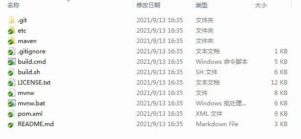
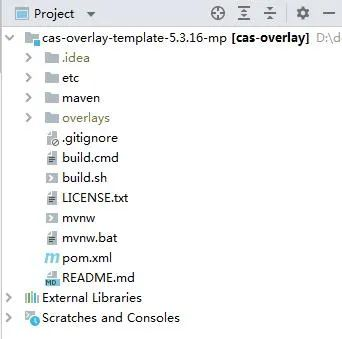

# CAS5.3-自定义准备 | 字痕随行

接下来会用几个篇幅的时间，记录一下如何定制自己的CAS Server。

使用CAS做单点登录也有年头了，貌似也没怎么详细记录过，这次也只能算个备忘，因为用的版本也很旧了。

**为什么使用CAS 5.3.16这个版本？**

高版本开始使用JDK11，另外使用Gradle编译。5.3.16这个版本支持JDK8，并且使用Maven编译，比较容易和目前的现实情况搭边。


**从哪里获得源码？**

Github因为某些不可描述的问题，时灵时不灵，所以可以从Gitee上获得源码：

```Plain Text
https://gitee.com/mirrors/CAS/tree/v5.3.16

```
不过这是CAS的源码，我们自定义的基础不是源码，而是另外一个工程：

```Plain Text
https://github.com/apereo/cas-overlay-template

```
同上原因，如果github不能访问，可以使用Gitee的导入功能，制作一份仓库镜像。

这是个Maven Template工程，简单来说就是我们在相同路径下创建的同名文件会覆盖原项目中的文件，从而达到定制的目的。

**如何创建项目？**

从远程仓库拉取一份源码至本地，如下图：




在Idea中打开此项目，经过漫长的处理之后，工程的结构如下：



在这个项目中，主要关注的是overlays，因为之后被替换的所有文件都来自于这里。

**帮助文档在哪里？**

在网上搜了半天，没有一丁点有用的东西，这时候就需要去查询官方文档资料，访问下面这个地址即可：

```Plain Text
https://apereo.github.io/cas/5.3.x/

```
一般都从Properties的设置入手。

以上，就是简单的开篇，其实熟练查找官方文档，能够解决大部分问题。

如果有问题，欢迎指正讨论。


觉的不错？可以关注我的公众号↑↑↑