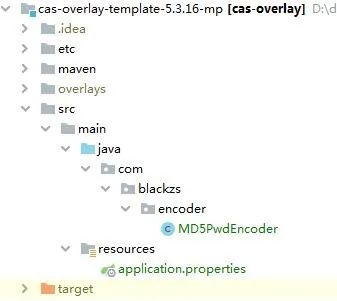
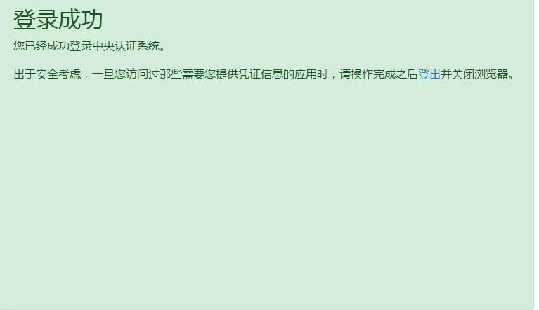

# CAS5.3-自定义数据库完成身份验证 | 字痕随行

上周五打了第三针疫苗，要注意休息。

周六凑热闹看了LOL决赛，然后又看了尼公子，所以周日直接躺了。

只能今天更新了，直接上主题，如题所述，下方是正文。

像[上一章](http://mp.weixin.qq.com/s?__biz=MzI3NTE2NzczMQ==&mid=2650046440&idx=1&sn=17d399c1fed636ae4f527edef0dc2291&chksm=f3083f74c47fb662f7bf89f467b0877efa1bf5bef7b631333449ba71bc8bccaa39a71c9319a5&scene=21#wechat_redirect)中的配置，只是个测试的Demo而已，正常业务情况下，不可能只配置一个用户，用于身份验证。

本章就是要实现从数据库读取登录信息，并且进行身份验证，场景如下：
1. 连接数据库的指定表。

2. 指定用户名和密码字段。

3. 密码通过MD5加密。

以上看着貌似挺麻烦，其实CAS Server本身已经将此场景实现，只需要通过更改配置文件实现即可。

**首先，修改配置文件。**

还是application.properties配置文件，先注释掉之前的用户配置：

```Plain Text
##
# CAS Authentication Credentials
#
#cas.authn.accept.users=casuser::Mellon

```
然后增加以下配置：

```Plain Text
# 开启JDBC认证
cas.authn.jdbc.query[0].sql=SELECT * FROM `你的账户表名` WHERE loginname =?
cas.authn.jdbc.query[0].fieldPassword=你的密码字段
cas.authn.jdbc.query[0].url=jdbc:mysql://127.0.0.1:3306/你的库?useUnicode=true&characterEncoding=UTF-8&autoReconnect=true&useSSL=false
cas.authn.jdbc.query[0].dialect=org.hibernate.dialect.MySQLDialect
cas.authn.jdbc.query[0].user=root
cas.authn.jdbc.query[0].password=root
cas.authn.jdbc.query[0].driverClass=com.mysql.jdbc.Driver

# 密码加密方式
cas.authn.jdbc.query[0].passwordEncoder.type=com.你的.MD5PwdEncoder
cas.authn.jdbc.query[0].passwordEncoder.characterEncoding=UTF-8
cas.authn.jdbc.query[0].passwordEncoder.encodingAlgorithm=MD5

```
**然后，需要一个加密类。**

如下自定义即可：

```Plain Text
public class MD5PwdEncoder implements PasswordEncoder {

    private final Logger logger = LoggerFactory.getLogger(MD5PwdEncoder.class);

    private static final String[] HEX_DIGITS = {"0", "1", "2", "3", "4", "5", "6", "7", "8", "9",
            "a", "b", "c", "d", "e", "f"};

    @Override
    public String encode(CharSequence charSequence) {
        try {
            MessageDigest md = MessageDigest.getInstance("MD5");
            String pwd = byteArrayToHexString(md.digest(charSequence.toString().getBytes(StandardCharsets.UTF_8)));
            logger.info("encode方法：加密前（ {} ），加密后（ {} ）", charSequence, pwd);
            return pwd.toUpperCase();
        } catch (NoSuchAlgorithmException e) {
            logger.error("对密码进行md5加密异常", e);
            return null;
        }

    }

    @Override
    public boolean matches(CharSequence charSequence, String s) {
        // 判断密码为空,直接返回false
        if (StringUtils.isBlank(charSequence)) {
            return false;
        }

        //调用上面的encode 对请求密码进行MD5处理
        String pass = this.encode(charSequence.toString());

        logger.info("matches方法：请求密码为：{} ，数据库密码为：{}，加密后的请求密码为：{}", charSequence, s, pass);
        //比较密码是否相等
        return pass.equals(s);
    }

    private static String byteArrayToHexString(byte b[]) {
        StringBuilder resultSb = new StringBuilder();
        for (byte aB : b) {
            resultSb.append(byteToHexString(aB));
        }

        return resultSb.toString();
    }

    private static String byteToHexString(byte b) {
        int n = b;
        if (n < 0) {
            n += 256;
        }
        int d1 = n / 16;
        int d2 = n % 16;
        return HEX_DIGITS[d1] + HEX_DIGITS[d2];
    }
}

```
要注意的是，一定要继承自PasswordEncoder，这个接口是CAS中的。

**最后，增加pom引用。**

因为使用数据库验证，还需要JDBC的支持，所以在pom文件中增加以下引用：

```Plain Text
<profile>
    <activation>
        <activeByDefault>true</activeByDefault>
    </activation>
    <id>default</id>
    <dependencies>
        <dependency>
            <groupId>org.apereo.cas</groupId>
            <artifactId>cas-server-webapp${app.server}</artifactId>
            <version>${cas.version}</version>
            <type>war</type>
            <scope>runtime</scope>
        </dependency>
        <!--
        ...Additional dependencies may be placed here...
        -->
        <dependency>
            <groupId>org.apereo.cas</groupId>
            <artifactId>cas-server-support-jdbc</artifactId>
            <version>${cas.version}</version>
        </dependency>
        <dependency>
            <groupId>mysql</groupId>
            <artifactId>mysql-connector-java</artifactId>
            <version>5.1.36</version>
        </dependency>
    </dependencies>
</profile>

```
修改后的工程结构如下：



重新使用Maven Clean和Package命令后，启动tomcat，使用数据库中的用户名和密码登录：



以上，就是本次内容，如有错误，欢迎指正。


觉的不错？可以关注我的公众号↑↑↑