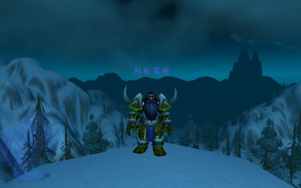
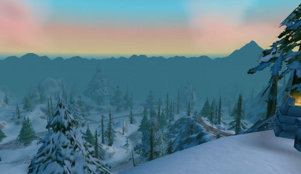
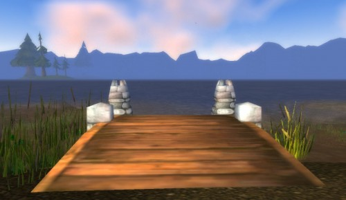
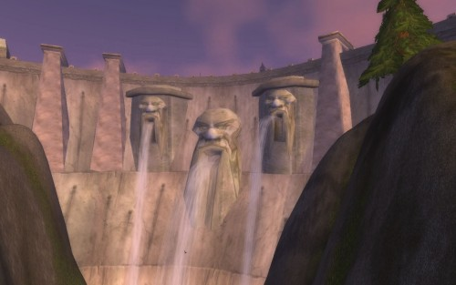

# 哦| 字痕随行

哦，从头说起吧，老实说我并不能算上老玩家，我在开服的那天并没有登入游戏，事实上我那时候还在沉迷于一款叫做《华夏》的游戏。虽然我不曾进入游戏，不过身边的先行者已经向我充分展示了它的魅力。终于在两天后的刷夜生活中，我踏上了这片神奇的土地。

不可思议，那时的我竟然喜欢矮人这个种族，再加上片头动画的影响，于是我顺理成章的成为了一名猎人，而从这一刻我的猎人情节开始发挥起作用，这在后面的历程中可见一斑。

看着口中呼出的白气，我费力的晃动着屏幕，看向远处的雪山，看向苍白的天空，看着白茫茫的大地，就这样“霜伤”诞生了。

事实上我并没有想象中的那么激动，我只是走上前去接了个任务，就开始游荡于初始的怪堆之中。那时候真是人山人海，导致我想虐待一条小狼都要千辛万苦手疾眼快，这是一种什么精神。

当我看见大耳朵暗夜精灵时，我赞叹道苗条啊，实际上这个暗夜精灵已经18级了，而她还在快乐的做着1级的任务。那时候的人们都很天真，就如大眼睛侏儒法师总是用匕首砍怪。

在那一晚上我升了8级，在现在看来这可真慢，可是在那时我觉得非常快，而我在这一晚过后，就融入了这个世界，从此就是10年。

**要包包吗？**

那是个午夜，我自从有了宠物后，非常happy的在矮人挖掘场里面敲怪。四周静谧，天空中的圆月散发清冷的光辉，白雪皑皑，我很喜欢这样的感觉。我不得不多说一下，我很喜欢丹莫洛和冬泉谷，这两个地方的雪让我有一种安静的感觉。

在我暗暗高兴，砍怪砍的无比兴奋的时候，一个大眼睛侏儒术士跑过来，“要包包吗？只需要几组亚麻布！”，我注视着侏儒，看着他在那里一摇一晃，接着我交易了几组亚麻布过去，于是我空余的包位上首次被占满，侏儒向我打了声招呼就跑向远方。

我注视着他，一个术士，小小的身影，然后打量身上的亚麻包，虽然比起现在动辄就20格的包显得微不足道，但是当时我确实很高兴，终于不用往外面扔东西了，那种肉疼，简直不是一般的痛苦。

就这样，我度过了一个愉快的夜晚，我很高兴在那个夜晚遇到这个大眼睛可爱侏儒，当晚的这幕也深深藏入记忆。

**破裂的天空**

5月1日，放假了，我回到家，在我的PIII1G+512M内存+32M显卡上安装了魔兽世界，然后迫不及待的进入，草绿的，人模糊地，一切都很正常，可是当我望向天空的时候，我惊呆了，这破裂的天空，五彩斑斓，于是在这之后的一段时间里面我再也没有欣赏天空的月色，恁谁看到这样的天空都有一种崩溃的感觉。

我来到了洛克莫丹，看到了洛克湖，这里也是人山人海，矮人侏儒人类，也许唯一少见的就是精灵了，也是，他们在海那边。

我为了一把白色的猎枪而努力，我一银币一银币的攒着钱，每次当我回到旅馆我总是垂涎于这把猎枪，虽然它只是个白色的物品，可是要知道它比我手中的灰色物品好多了，那是一种什么心情。

反正我总是徘徊在商人那里，几银币对于我来说就像登天那么麻烦，直到多年以后，我再回到洛克莫丹我总想起这个时候的往事。

**孤独的渔者**

我在水中游着，还好我没有恐水症，也不会像一些人不会控制上浮，至少我淹不死自己，这点让我很高兴，发现我真有玩这游戏的天赋。

我从一个稍微平缓的浅滩上岸，这时我发现一个矮人在钓鱼，而陪伴他的是一头狼，他生死不离的宠物。

“能钓到鱼吗？”，我问。

“当然，小声点，别吓跑了鱼！”

于是我噤若寒蝉似的在旁边张望，这一切那么的寂静和谐。

当我现在回想起来，我还是有一种莫名的感动，在这静谧的夜晚，一位渔者在他的宠物陪伴下，快乐的享受钓鱼的乐趣。

我们离真正的快乐越来越远。就像我上高中时从来没有真正的快乐过，只有考到理想的成绩和名次才能稍微微笑。

我也不知道这是为什么，当我们追求一件事的时候，我们总是很容易偏离正常的轨道，然后在遥远的后来才想起当初那份单纯的感动和快乐。

也许我也应该拿起鱼竿带着我的小宠物找一片阴凉享受难得的快乐。

**圣骑士与鳄鱼**

回忆飘向远方，我突然记起我是如何得知可以学习专业技能的。

又是个夜晚，没办法，我比较喜欢艾泽拉斯的夜晚，静谧神秘。

我一个人在洛克湖中心的岛上击杀鳄鱼，看着经验条蹭蹭的向前涨，我异常快乐，人生啊，还有比这更快乐的事情吗？

这时候一个圣骑士游上岛来，不打怪，也不是路过，而是不停地在冲着鳄鱼尸体做手势，然后鳄鱼就消失了，我惊为天人，此人使得何种魔法。

“你在干什么？”

“剥皮”

“这皮还能剥？”

“当然，这是技能”

“我能学吗？”

“铁炉堡”

那时候的人还是都说全称的，于是我屁颠屁颠的赶往铁炉堡，第一次学会了人物的两个专业技能，剥皮和制皮。
然后，我发现击杀动物是如此的快乐，人生啊，还有比这更快乐的事情吗？

**山寨部落**

我悠哉悠哉的游荡于洛克莫丹，这地方真不错，有山有水有美女，让我这个矮子猎欣喜异常。

突然，从侧方冲出三个牛头，是牛头，我清晰的记得，也许可能，反正我没有刚住，就很愉快的到底了，当我死不瞑目的刹那，我看到了部落的图标。他喵的，这不是PVE服务器吗？我怎么会被PK，人生啊，还有比这更痛苦的事情吗？

于是，我很大声很不愤的在综合频道发送信息，“这地方为什么会有部落？为什么还能打我？”

“就是，我也被打”

……

看来不止我一个人。

“那是NPC，不是玩家。”

一句话道破事实真相，他喵的，哪来的这么高的NPC，而且还在这里乱窜。

只有我的矮子猎遭受过如此待遇，多年以后我才隐约知道，这是定时刷的，我曾专门寻找其报仇，当然，结果很明显，报仇未果。

那么，你碰到过吗？我的朋友。

**巨石水坝**

我记不起来我什么时候知道巨石水坝真面目的，不过我知道当我看到这座水坝的真面目的时候，我很庆幸我拯救了这座墙。

我跑到水坝之上，这里视野很开阔，不过鉴于当时我电脑的配置，我眼中也就只有那水还凑合，不过还是一片黑水。

我跑上跑下，千辛万苦的做了精英任务，然后又跑到远在湿地边缘的黑矮人营地，累的半死，完成了这个超长的任务线，毁坏了黑矮人的炸弹，最后的结果我很欣慰，他说我拯救了巨石水坝(他喵的，被死亡之翼给毁了，最壮观最雄伟的地方，我对这位环境破坏者很有意见，活该被推)，我和我的队友们泪流满面，这任务真长真累人。

说实在的，我不认为这个记忆很清晰，但是我在此写出来主要是为了纪念那个时代，纪念那晚所遇到的所有队友。

那是我最长的一次组队，那也是对我洛克莫丹的收尾。

觉的不错？可以关注我的公众号↑↑↑
