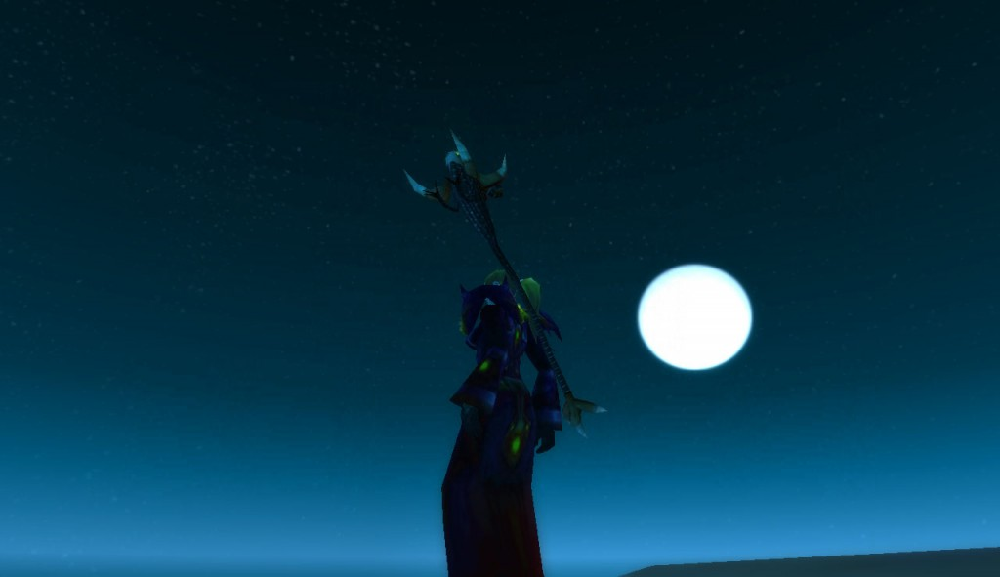

# 雾蒙蒙、湿漉漉 | 字痕随行

## 米奈希尔港

二十级的时候终于来到了米奈希尔港，当时的港口很美丽，我是夜晚到达的，站在港口的木质地板上欣赏着远方的月光，内心是如此平静，从此养成了习惯，喜欢在米奈希尔背靠月亮留下一张特写。

港口的酒馆给人的感觉就是充满了水手的汗臭味，充满了喧嚣，但是悠扬的小调吹散了身上的疲惫。这里有矮人的美酒，同时也有美味的奶酪，还掺杂了人类特有的烹饪手法，让人流连忘返。二层的隔间供人能够短暂休息，那床看起来还算柔软，冒险者就不要讲究卫生了，和衣而睡吧，至少不用担心野外的猛兽了。

当时，这是我经历的第一间最像旅店的旅店，矮人们那边的旅馆更像是喝酒的酒馆，而这里真的能够提供短暂的休息，我惊叹于设计师的功力，我从未在之前的任何游戏里见到过如此逼真，能够让人身临其境的场所。当时被WOW又一次震动了。

美丽的月光下，孤独的水手唱着歌，他在悼念死去而不能安息的队友吗？

旅馆后搁浅的沉船已经被鱼人占领，是否还有需要交代的往事？

堡垒在凝望着远方，它在守护着什么？

来来往往的渡船，将一队队陌生的冒险者带向何方？

匆匆过往的人们将会在未来谱写何样的篇章？

## 鱼人与迅猛龙

经历过那个人山人海年代的人，总是对两个物种记忆犹新，甚至于充满恐惧。一种就是子哇乱叫的鱼人，另外一种就是漫山遍野的迅猛龙。

先说说鱼人吧，我很好奇这种东西是怎么被造出来，滑腻的皮肤遮掩不了那一双滴溜乱转的双眼，两条强健有力的双腿促使他们能够追杀任何物种，同时扰人心智的怪音让你只顾闷头跑路，最关键的是这帮孙子是群居的，于是死亡不可避免。

米奈希尔港门口就有一片这种鱼人，米奈希尔港的重要任务线之一就是围着这帮鱼人展开。即使当时人再多，那也有被这帮家伙追的抱头乱窜的一幕，而且这一幕一幕发生在大多数冒险者身上。当时鱼人的头颅还滴答汤，看着包裹里面的一打头颅，心中一片恶寒。苦于任务十分稀少，在二十二级之前都是靠刷这种怪物而度过的，同时也伴随着恐慌，现在想起来仍旧恶寒不已。

米奈希尔港的另外一个重要任务线是围绕着迅猛龙展开的，你会觉得侏罗纪公园真是哪里都有，虚拟的NPC也会因为各种意外而被这帮动物围攻。至少，恐龙这个玩意并不陌生（克赛，前来拜访，哈哈），再一个，没有鱼人那种滑腻让人恶心的感觉。我这矮子猎人很想抓个迅猛龙当宠物，可惜当时还是不能如愿，只能一头扎进挖掘场，使用我那劣质火枪驱赶这群不速之客。于是，在这月圆之夜，在一个一个土堆之间，一个矮人上蹿下跳，旁边的宝贝宠物熊慢悠悠的顶上去退回来，似乎也是一副和谐的画面，不和谐的是，杀了还要剥皮，幸好剥完了不会留下一幅幅枯骨。

恐龙和鱼人在低级别地图也算大户，至今仍旧游荡在那里，只是少了那份喧嚣，多了一份宁静。其实任何东西总会经历繁荣，然后趋于平静，而平静也许才是不变的主题。

## 接不到的任务

湿地任务的尾声发生在萨尔多大桥，这里充斥了黑铁矮人，60级的时候这里的任务怪都是精英，我们需要小心翼翼的行进，对于一个孤独的猎人来说，这里更是相当难混。

今天讲述的重点并不是这群黑铁矮人，而是那该死的的任务叹号，你看着那个金黄色的叹号明明就在那里，可是就是接不到，甚至于还要冒着摔死的危险一遍一遍的尝试。

这个任务的具体位置是在一个桥墩子上面，我觉的萨尔多大桥应该是双向六车道的，可是由于黑铁矮人的入侵，炸毁了一半，所以那边只剩个桥墩孤零零的竖立在那里，关键就在这里，前不着村后不着店的桥墩子上面有个任务，从远处看是个矮人，脑袋上顶个充满诱惑力的金色叹号，不停的勾引着我：来吧，过来就给你任务！

于是，我就像条狗一样，先是跳起来摔下去，然后爬上来接着跳，如此反复。可是苍天啊，我就是跳不过去啊，臣妾真的做不到啊，我去年买了个表。

我为了这个任务磨洋工磨了整整一个下午啊，最后的结果显而易见，就是过不去，后来只能故作潇洒的挥挥手，爷去也。

多年以后，闲来无事，终于滚到了上面，我发现这个需要运气的，开个豹守边缘起跳，运气好还是能跳过去的，也算是了却了一桩心愿。现在回想起来，我就记得那光灿灿的金黄色大叹号，也算茶前饭后的一份谈资。

觉的不错？可以关注我的公众号↑↑↑